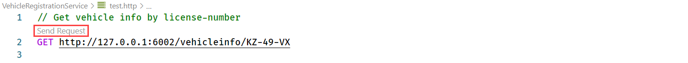
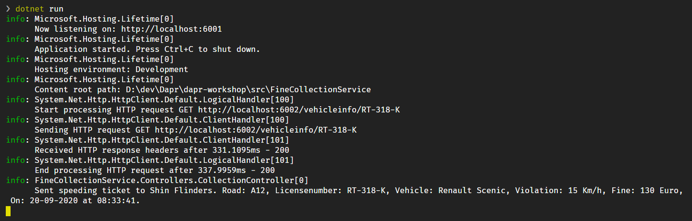

# Challenge 1 - Run the application

[< Previous Challenge](./Challenge-00.md) - **[Home](../README.md)** - [Next Challenge >](./Challenge-02.md)

## Introduction

In this assignment, you'll run the Traffic Control application to ensure that everything works correctly.

## Description

As mentioned in the introduction, the hackathon assignments are built upon an existing microservice reference app, entitled the ***Traffic Control Application***. To start, you'll test the Traffic Control app to ensure that the application runs and your environment is configured correctly. You'll use Visual Studio Code to start each of the 4 microservices shown below:


Keep in mind that you'll be running the application ***without*** Dapr technology. However, as you work through the challenges, you'll add Dapr Building Blocks and Components to the application, step-by-step. Figure depicts the microservices.

- Start by running the **Vehicle Registration** microservice. It exposes a single endpoint that listens for requests for vehicle and owner information.

- Next, run the **Fine Collection** service. It exposes an endpoint that assign fines to speeding vehicles. To generate a fine, the Fine Collection service must make a call to the Vehicle Registration to obtain driver information.

- Then, run the **Traffic Control** service. It exposes entry and exit endpoints that capture a vehicle's a speed. When a motorist exceeds the speed limit, Traffic Control will call the Fine Collection service.
- Finally, run the **Simulation** service. It simulates passing cars at varying speeds. It exposes entry and exit cameras that photograph the license plate of each vehicle. The telemetry is sent to the Traffic Control service.

> The Camera Simulation service is implemented as a Console application, the other services as as API applications.

## Success Criteria

To complete this assignment, you must achieve the following goals:

1. Successfully start each of the four microservices with no errors.

1. Observe activity flow from the top-level simulation service all the way through the Fine Collection service.

  > If you encounter an error, double-check to ensure that you have correctly installed all the [prerequisites](README.md#Prerequisites) for the workshop!  

## Tips

- Run the services in VS Code.

- Within a single VS Code instance, open a Terminal window for each service.

- Start each service using a ***dotnet run*** command.

- To test the VehcileRegistration service, use the REST Client extension tool for VS Code.

  1. Open the file `src/VehicleRegistrationService/test.http` using the (file) Explorer feature in VS Code. The request in this file simulates retrieving the vehicle and owner information for a certain license-number.

  1. Click on Send request link, located immediately above the GET request in the file and highlighted below in a red box, to send a request to the API:
  

  1. The response of the request will be shown in a separate window on the right. It should be a response with HTTP status code 200 OK and the body should contain some random vehicle and owner-information:
  
    ```json
   HTTP/1.1 200 OK
   Connection: close
   Date: Mon, 01 Mar 2021 07:15:55 GMT
   Content-Type: application/json; charset=utf-8
   Server: Kestrel
   Transfer-Encoding: chunked
   
   {
       "vehicleId": "KZ-49-VX",
       "brand": "Toyota",
       "model": "Rav 4",
       "ownerName": "Angelena Fairbairn",
       "ownerEmail": "angelena.fairbairn@outlook.com"
   }
   ```
    1. Finally, check the logging in the terminal window. It should look like this:

  

- For each service, check the logging in the corresponding terminal window. 

## Advanced Challenges (Optional)

## Learning Resources
